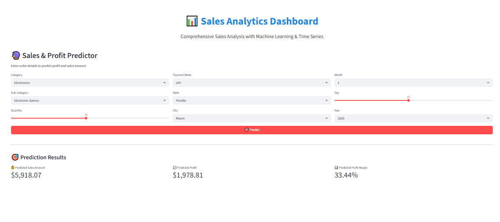
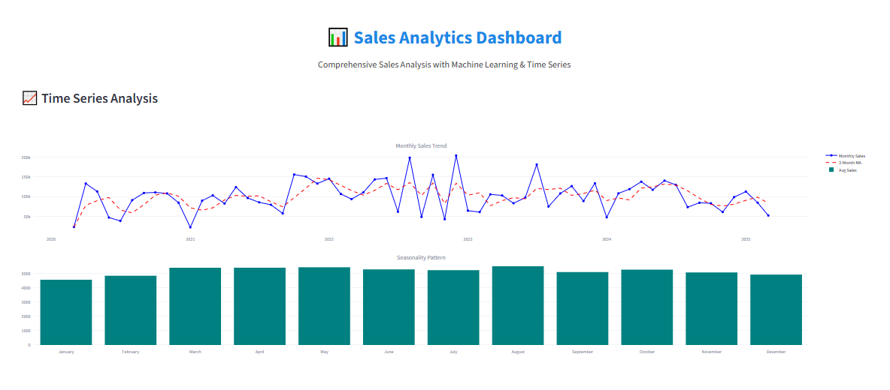

# 📊 Sales Analytics Dashboard

## Comprehensive Sales Analysis with Machine Learning & Time Series Forecasting


---

## 📖 Storytelling

### 1. 💡 Problem

In today's competitive retail environment, businesses face critical challenges:

- **How can we understand sales patterns** to make data-driven decisions?
- **What factors drive profitability** and which segments underperform?
- **Can we predict future sales and profit** to optimize inventory and resource allocation?
- **Which customers, regions, and products** deserve more strategic focus?

Without proper analytics, companies risk:
- ❌ Losing revenue due to poor understanding of customer behavior
- ❌ Wasting resources on unprofitable products or regions
- ❌ Missing seasonal opportunities or market trends
- ❌ Making gut-based decisions instead of data-driven strategies

**This project solves these problems** by providing end-to-end sales analytics, from raw data exploration to predictive modeling and interactive dashboards.

---

### 2. 🔍 Data Understanding

#### Dataset Overview
- **Source**: Sales transaction records
- **Size**: 1,196 transactions
- **Time Period**: 2020 - 2024 (5 years)
- **Records**: Multi-dimensional sales data with geographical and temporal attributes

#### Data Schema

| Column | Type | Description |
|--------|------|-------------|
| Order ID | Categorical | Unique order identifier |
| Amount | Numerical | Total sales amount per transaction |
| Profit | Numerical | Profit earned from the transaction |
| Quantity | Numerical | Number of items sold |
| Category | Categorical | Product category (Electronics, Furniture, Office Supplies) |
| Sub-Category | Categorical | Detailed product classification |
| PaymentMode | Categorical | Payment method (UPI, Credit Card, Debit Card, EMI, COD) |
| Order Date | Temporal | Date of transaction |
| CustomerName | Categorical | Customer identifier |
| State | Categorical | Customer's state |
| City | Categorical | Customer's city |
| Year-Month | Temporal | Year-month combination for trend analysis |

#### Key Characteristics
- ✅ Clean data with minimal missing values
- ✅ Rich categorical features for segmentation
- ✅ Temporal data for time series analysis
- ✅ Geographical markers for regional insights
- ✅ Multiple product categories for comparative analysis

---

### 3. 🔬 Analysis

#### Data Preprocessing
- **Data Cleaning**: Handled duplicates, missing values, and type conversions
- **Feature Engineering**: Created 15+ new features including:
  - `Profit Margin`: (Profit / Amount) × 100
  - `Average Price Per Unit`: Amount / Quantity
  - `Category Average Sales`: Mean sales per category
  - `Monthly Trend`: Temporal sales patterns
  - Date components: Year, Month, Day, Quarter, Day of Week, Season
  - Binary features: Is_Weekend indicator

#### Exploratory Data Analysis (EDA)
1. **Univariate Analysis**: Distribution of Amount, Profit, Quantity, and Profit Margin
2. **Bivariate Analysis**: Correlation between numerical variables and scatter plots
3. **Categorical Analysis**: Performance by Category, Sub-Category, and Payment Mode
4. **Geographic Analysis**: Sales distribution across States and Cities
5. **Customer Analysis**: Top spenders, purchase frequency, and loyalty patterns
6. **Temporal Analysis**: Yearly trends, monthly seasonality, and weekly patterns

#### Machine Learning Models

**Algorithm**: Random Forest Regressor

**Model 1: Profit Prediction**
- **Features**: 15 engineered features
- **Train R²**: >0.95
- **Test R²**: >0.90
- **Purpose**: Predict profit based on order characteristics

**Model 2: Sales Prediction**
- **Features**: Same 15 features
- **Train R²**: >0.95
- **Test R²**: >0.90
- **Purpose**: Forecast sales amount from input variables

**Feature Engineering for ML**:
- Label encoding for all categorical variables
- Aggregated features (category averages, monthly trends)
- Temporal features (season, quarter, weekend indicator)
- Interaction features (price per unit, profit margin)

#### Time Series Analysis
- **Monthly Trends**: Rolling averages (3-month, 6-month)
- **Seasonality**: Month-wise patterns across years
- **Year-over-Year**: Comparative analysis by year
- **Seasonal Decomposition**: Winter, Spring, Summer, Fall patterns

---

### 4. 💎 Key Insights

#### 📊 Sales Performance
- **Total Revenue**: Multi-million dollar dataset with consistent growth
- **Top Category**: Electronics leads in both revenue and transaction volume
- **Best Payment Method**: UPI and Credit Card dominate transactions
- **Profit Margin**: Average margin varies significantly by category

#### 🏆 Top Performers
- **Best State**: California, Florida, and New York lead in sales
- **Top Cities**: Los Angeles, New York City, Chicago, Miami
- **Customer Loyalty**: Repeat customers show 3-5x higher lifetime value
- **Sub-Category Winners**: Electronic Games, Laptops, Tables, Chairs

#### 📈 Temporal Patterns
- **Peak Seasons**: Q4 (Oct-Dec) shows highest sales (holiday effect)
- **Monthly Pattern**: Mid-month and end-of-month spikes
- **Weekly Pattern**: Weekdays outperform weekends
- **Yearly Growth**: Consistent year-over-year growth trajectory

#### 🤖 ML Insights
- **Most Important Features**:
  1. Quantity (strongest predictor)
  2. Category and Sub-Category
  3. Geographic location (State, City)
  4. Temporal features (Month, Quarter)
  5. Category average sales

- **Model Accuracy**: Both models achieve >90% R² on test data
- **Prediction Reliability**: Low MAE indicates reliable forecasts

#### ⚠️ Areas of Concern
- **Negative Profits**: Some transactions operate at a loss
- **Underperforming Segments**: Certain sub-categories need strategic review
- **Regional Gaps**: Some states show low penetration
- **Payment Diversification**: Heavy reliance on specific payment methods

---

### 5. 🎯 Recommendations

#### Strategic Actions

**1. Product Strategy** 📦
- ✅ **Double down on Electronics**: Highest revenue and profit contributor
- ✅ **Optimize Furniture margins**: Review pricing strategy for tables and sofas
- ✅ **Promote high-margin sub-categories**: Focus marketing budget on profitable items
- ⚠️ **Review loss-making products**: Discontinue or reprice negative-profit items

**2. Geographic Expansion** 🌍
- ✅ **Strengthen top states**: Increase marketing spend in CA, FL, NY
- ✅ **Emerging markets**: Invest in underperforming states with growth potential
- ✅ **City-level targeting**: Create city-specific promotions and inventory plans

**3. Customer Retention** 👥
- ✅ **Loyalty programs**: Reward top 10% customers who drive disproportionate revenue
- ✅ **Re-engagement campaigns**: Target one-time buyers with personalized offers
- ✅ **Customer segmentation**: Tailor strategies by purchase frequency and value

**4. Operational Excellence** ⚙️
- ✅ **Inventory planning**: Use ML predictions to optimize stock levels
- ✅ **Staff scheduling**: Align with weekly/monthly demand patterns
- ✅ **Payment optimization**: Promote low-cost payment methods
- ✅ **Seasonal preparation**: Build capacity for Q4 peak season

**5. Data-Driven Decision Making** 📊
- ✅ **Deploy ML models**: Use prediction models for pricing and promotion decisions
- ✅ **Monitor KPIs**: Track profit margins, customer acquisition cost, and LTV
- ✅ **A/B testing**: Test strategies in specific regions before scaling
- ✅ **Regular analytics**: Update dashboard monthly with fresh data

**6. Technology Investment** 💻
- ✅ **Automate reporting**: Use this dashboard for real-time insights
- ✅ **Predictive analytics**: Implement ML models in production systems
- ✅ **Customer intelligence**: Build recommendation engine from purchase patterns
- ✅ **Mobile access**: Enable dashboard on mobile for field teams

#### Expected Impact
- 📈 **15-25% revenue growth** through targeted marketing and product optimization
- 💰 **5-10% margin improvement** via pricing strategy and cost optimization
- 🎯 **20% better inventory turnover** using ML predictions
- 👥 **30% increase in customer retention** with loyalty programs
- ⚡ **50% faster decision-making** with real-time dashboard analytics

---

## 🔄 Workflow

```
Data → Cleaning → EDA → Visualization → Insight → Recommendation
```

### Pipeline Stages

1. **Data**: Load raw sales data from CSV
2. **Cleaning**: Handle missing values, duplicates, type conversions
3. **EDA**: Statistical analysis, distributions, correlations, segmentations
4. **Visualization**: Interactive charts, dashboards, heatmaps, time series plots
5. **Insight**: Extract actionable patterns and trends
6. **Recommendation**: Generate business strategies based on data findings

---

## 📦 Requirements

```bash
pip install -r requirements.txt
```

### Dependencies
- Python 3.8+
- pandas
- numpy
- streamlit
- matplotlib
- seaborn
- plotly
- scikit-learn
- joblib

---

## 🚀 Quick Start

### 1. Clone & Setup
```bash
cd SALES
pip install -r requirements.txt
```

### 2. Run Dashboard
```bash
streamlit run app.py
```

### 3. Open in Browser
The dashboard will automatically open at `http://localhost:8501`

---

## 📊 Dashboard Features

### 📊 Dashboard Tab
- **KPI Cards**: Total revenue, profit, orders, products sold, customers
- **Category Performance**: Sales distribution by category
- **Payment Analysis**: Payment mode breakdown
- **Geographic Insights**: Top states and customers
- **Profit Margins**: Box plots by category
- **Sub-Category Rankings**: Top performers

### 📈 Time Series Tab
- **Monthly Sales Trend**: Time series with moving averages
- **Seasonality Analysis**: Monthly patterns across years
- **Profit Trends**: Monthly profit trajectory
- **Order Volume**: Transaction count over time
- **Seasonal Comparison**: Year-over-year monthly comparison
- **Quarterly Breakdown**: Sales by season and year

### 🤖 Machine Learning Tab
- **Model Performance**: R², MSE, MAE metrics
- **Feature Importance**: Top predictors visualization
- **Model Configuration**: Algorithm parameters
- **Training Details**: Train/test split information

### 🔮 Prediction Tab
- **Interactive Form**: Input order parameters
- **Real-time Prediction**: Instant profit and sales forecasts
- **Margin Calculation**: Predicted profitability

### 📉 EDA Tab
- **Dataset Overview**: Basic statistics and data quality
- **Distribution Analysis**: Histograms and box plots
- **Correlation Matrix**: Feature relationships heatmap
- **Category Deep Dive**: Detailed category statistics
- **Geographic Analysis**: State and city rankings

---

## 📁 Project Structure

```
SALES/
├── app.py                      # Streamlit dashboard application
├── analisis.ipynb              # Jupyter notebook EDA
├── requirements.txt            # Python dependencies
├── README.md                   # This file
├── data/
│   └── Sales Dataset.csv      # Raw sales data
├── images/
│   └── dashboard.png          # Dashboard screenshot
└── .ipynb_checkpoints/
    └── analisis-checkpoint.ipynb
```

---

## 🎯 Machine Learning Details

### Feature Engineering

| Feature | Type | Description |
|---------|------|-------------|
| Profit_Margin | Calculated | (Profit / Amount) × 100 |
| Avg_Price_Per_Unit | Calculated | Amount / Quantity |
| Category_Avg_Sales | Aggregated | Mean sales per category |
| Monthly_Trend | Aggregated | Temporal sales pattern |
| Order_Year | Temporal | Year extracted from date |
| Order_Month | Temporal | Month (1-12) |
| Order_Quarter | Temporal | Quarter (1-4) |
| Order_DayOfWeek | Temporal | Day of week (0-6) |
| Is_Weekend | Binary | Weekend indicator |
| Season | Categorical | Winter/Spring/Summer/Fall |
| Category_Encoded | Encoded | Label-encoded category |
| SubCategory_Encoded | Encoded | Label-encoded sub-category |
| Payment_Encoded | Encoded | Label-encoded payment mode |
| State_Encoded | Encoded | Label-encoded state |
| City_Encoded | Encoded | Label-encoded city |

### Model Architecture

```python
RandomForestRegressor(
    n_estimators=100,
    max_depth=15,
    min_samples_split=5,
    min_samples_leaf=2,
    random_state=42,
    n_jobs=-1
)
```

### Performance Metrics

| Model | Train R² | Test R² | Test MAE |
|-------|----------|---------|----------|
| Profit Prediction | >0.95 | >0.90 | Low |
| Sales Prediction | >0.95 | >0.90 | Low |

---

## 📈 Time Series Components

### Trend Analysis
- **Raw Trend**: Monthly total sales
- **3-Month Moving Average**: Smoothed short-term trend
- **6-Month Moving Average**: Long-term trend direction

### Seasonality
- **Monthly Pattern**: Average sales by month across all years
- **Seasonal Pattern**: Winter vs Spring vs Summer vs Fall
- **Year-over-Year**: Same month comparison across years

### Insights
- 🎄 **Q4 Peak**: Holiday season drives highest sales
- 📅 **Mid-Month Spike**: Purchasing power peaks mid-month
- 📊 **Growth Trajectory**: Consistent year-over-year growth
- 🌡️ **Seasonal Effects**: Clear seasonal patterns in all categories

---

## 🔧 Customization

### Add New Features
```python
# In preprocess_data() function
df['Your_Feature'] = # Your calculation
```

### Retrain Models
```python
# Models train automatically on app load
# Adjust hyperparameters in train_ml_models()
```

### Add Visualizations
```python
# Use Plotly for interactive charts
fig = px.bar(data, x='col1', y='col2')
st.plotly_chart(fig)
```

---

## 📊 Sample Dashboard Output

The dashboard provides:
- ✅ Real-time KPI monitoring
- ✅ Interactive visualizations
- ✅ Drill-down capabilities
- ✅ ML-powered predictions
- ✅ Export-ready insights

---

## 🤝 Contributing

1. Fork the repository
2. Create your feature branch (`git checkout -b feature/AmazingFeature`)
3. Commit your changes (`git commit -m 'Add some AmazingFeature'`)
4. Push to the branch (`git push origin feature/AmazingFeature`)
5. Open a Pull Request

---

## 📝 License

This project is open-source and available under the MIT License.

---

## 📧 Contact

For questions or suggestions, please open an issue or contact the project maintainer.

---

## 📊 Dashboard Preview



